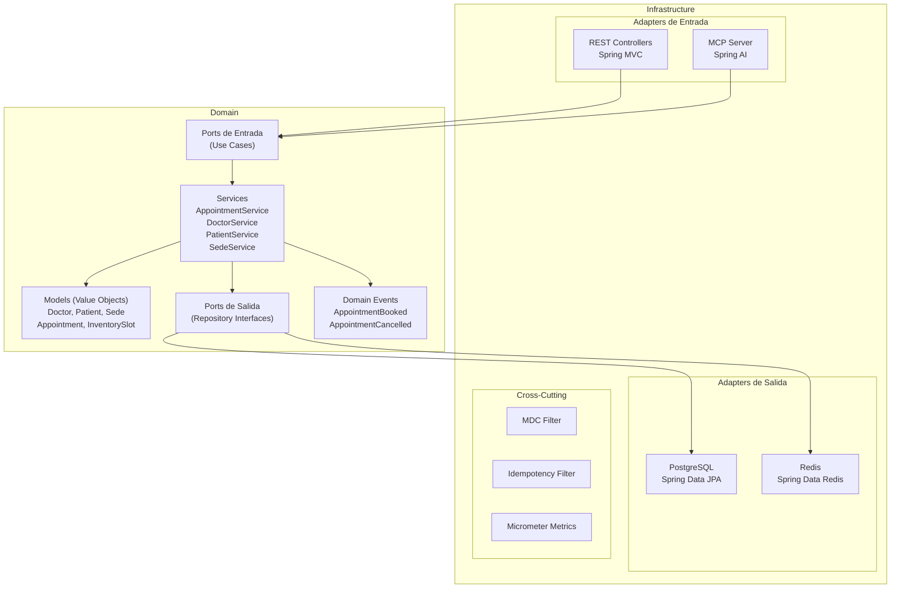
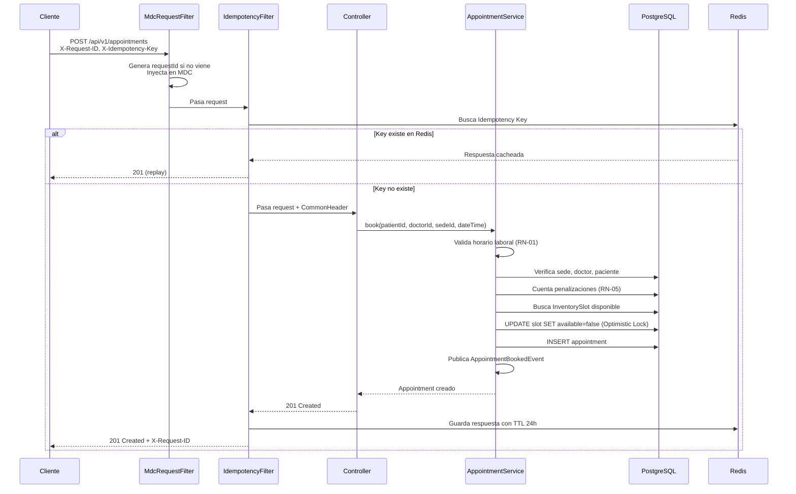
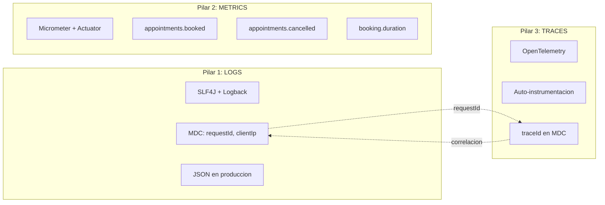
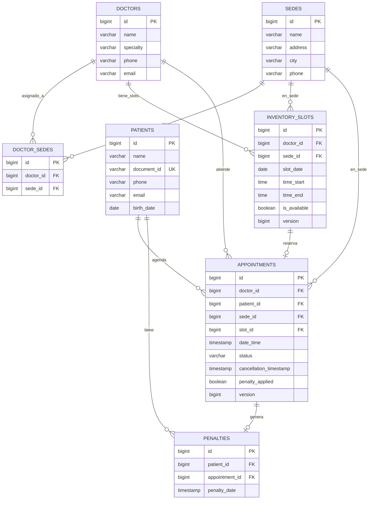
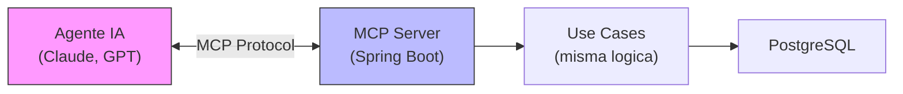

# MediSalud - Sistema de Agendamiento de Citas Medicas

**Prueba Tecnica** — Sistema de Agendamiento de Citas Medicas

**Fecha:** 22/06/2026
**Autor:** Yeferson Nova

---

API REST para el agendamiento de citas medicas en MediSalud, una clinica con multiples sedes. Permite a los pacientes reservar citas con medicos disponibles, controlar la disponibilidad por franja horaria y gestionar cancelaciones con penalizaciones.

## Arquitectura

Arquitectura Hexagonal (Ports & Adapters). El dominio es puro Java sin dependencias de frameworks. La infraestructura adapta el dominio al mundo exterior.



## Flujo de una Peticion



## Observabilidad (3 Pilares)

La observabilidad es fundamental para responder a problemas tecnicos y de negocio, y para llevar un control completo del sistema. Con los tres pilares implementados (Logs, Metricas y Traces) es posible diagnosticar incidentes en produccion, identificar cuellos de botella en el flujo de reservas, medir tiempos de respuesta y correlacionar cualquier request desde el momento en que entra hasta que sale, usando el `requestId` como hilo conductor.



Todas las fechas y timestamps estan en **UTC** (zona horaria universal coordinada 0).

Formato de log:
```
2026-07-06T10:30:15Z [http-nio-8080-1] [a3f2b1c8] INFO AppointmentService - Appointment booked: id=42
```

Endpoints de observabilidad:
- `GET /actuator/health` — estado de la app
- `GET /actuator/metrics` — metricas disponibles
- `GET /actuator/prometheus` — metricas en formato Prometheus

## Modelo de Datos



## Stack Tecnologico

| Componente | Tecnologia |
|-----------|-----------|
| Lenguaje | Java 25 |
| Framework | Spring Boot 3.5.x |
| Persistencia | Spring Data JPA + PostgreSQL 16 |
| Cache/Idempotencia | Redis 7 |
| Contenedores | Docker + Docker Compose |
| Migraciones | Flyway |
| Validacion | Jakarta Bean Validation |
| Observabilidad | Micrometer + Actuator + OpenTelemetry |
| API Docs | SpringDoc OpenAPI (Swagger UI) |
| Tests | JUnit 5 + Mockito |
| Build | Maven |

## Ejecucion Local

### Requisitos
- Docker y Docker Compose
- Java 25 (para desarrollo sin Docker)

### Con Docker Compose

```bash
cp .env.example .env
# Editar .env con las credenciales deseadas
docker compose up
```

La API estara disponible en `http://localhost:8080`.

### Sin Docker (desarrollo)

Asegurate de tener PostgreSQL y Redis corriendo localmente.

```bash
export DB_URL=jdbc:postgresql://localhost:5432/medisalud
export DB_USERNAME=medisalud
export DB_PASSWORD=medisalud
export REDIS_HOST=localhost
./mvnw spring-boot:run
```

### Swagger UI

Disponible en `http://localhost:8080/swagger-ui.html`

## Endpoints API

### Sedes

| Metodo | Ruta | Status | Descripcion |
|--------|------|--------|-------------|
| POST | `/api/v1/sedes` | 201 | Crear sede |
| GET | `/api/v1/sedes` | 200 | Listar sedes |
| GET | `/api/v1/sedes/{id}` | 200 | Obtener sede |
| PUT | `/api/v1/sedes/{id}` | 200 | Actualizar sede |
| DELETE | `/api/v1/sedes/{id}` | 204 | Eliminar sede |
| GET | `/api/v1/sedes/{id}/doctors` | 200 | Medicos de una sede |
| POST | `/api/v1/sedes/{sedeId}/doctors/{doctorId}` | 201 | Asignar medico |
| DELETE | `/api/v1/sedes/{sedeId}/doctors/{doctorId}` | 204 | Desasignar medico |

### Medicos

| Metodo | Ruta | Status | Descripcion |
|--------|------|--------|-------------|
| POST | `/api/v1/doctors` | 201 | Crear medico |
| GET | `/api/v1/doctors` | 200 | Listar medicos |
| GET | `/api/v1/doctors/{id}` | 200 | Obtener medico |
| PUT | `/api/v1/doctors/{id}` | 200 | Actualizar medico |
| DELETE | `/api/v1/doctors/{id}` | 204 | Eliminar medico |

### Pacientes

| Metodo | Ruta | Status | Descripcion |
|--------|------|--------|-------------|
| POST | `/api/v1/patients` | 201 | Crear paciente |
| GET | `/api/v1/patients` | 200 | Listar pacientes |
| GET | `/api/v1/patients/{id}` | 200 | Obtener paciente |
| PUT | `/api/v1/patients/{id}` | 200 | Actualizar paciente |
| DELETE | `/api/v1/patients/{id}` | 204 | Eliminar paciente |

### Citas

| Metodo | Ruta | Status | Descripcion |
|--------|------|--------|-------------|
| POST | `/api/v1/appointments` | 201 | Reservar cita |
| GET | `/api/v1/appointments` | 200 | Listar citas (filtros opcionales) |
| GET | `/api/v1/appointments/{id}` | 200 | Obtener cita |
| PATCH | `/api/v1/appointments/{id}/cancel` | 200 | Cancelar cita |
| PATCH | `/api/v1/appointments/{id}/reschedule` | 200 | Reprogramar cita |
| GET | `/api/v1/appointments/available-slots` | 200 | Slots disponibles |

### Ejemplos de Request/Response

**Reservar cita:**
```bash
curl -X POST http://localhost:8080/api/v1/appointments \
  -H "Content-Type: application/json" \
  -H "X-Request-ID: abc123" \
  -H "X-Idempotency-Key: unique-key-001" \
  -d '{
    "patientId": 1,
    "doctorId": 1,
    "sedeId": 1,
    "dateTime": "2026-07-06T10:00:00"
  }'
```

Response (201):
```json
{
  "id": 1,
  "doctorId": 1,
  "patientId": 1,
  "sedeId": 1,
  "dateTime": "2026-07-06T10:00:00",
  "status": "PROGRAMADA",
  "cancellationTimestamp": null,
  "penaltyApplied": false
}
```

**Consultar slots disponibles:**
```bash
curl "http://localhost:8080/api/v1/appointments/available-slots?doctorId=1&sedeId=1&startDate=2026-07-06&endDate=2026-07-10"
```

**Error de slot ocupado (409):**
```json
{
  "timestamp": "2026-07-06T10:30:00Z",
  "status": 409,
  "error": "Conflict",
  "errorCode": "SLOT_NOT_AVAILABLE",
  "message": "El medico con id 1 ya tiene una cita en la franja 2026-07-06T10:00",
  "requestId": "abc123",
  "path": "/api/v1/appointments"
}
```

## Reglas de Negocio

| Regla | Descripcion | HTTP |
|-------|-------------|------|
| RN-01 | Horario: L-V 08:00-18:00, S 08:00-13:00, D cerrado. Franjas de 30 min. | 400 |
| RN-02 | Un medico no puede tener 2 citas en la misma franja (Optimistic Lock) | 409 |
| RN-03 | Fecha de nacimiento no puede ser futura | 400 |
| RN-04 | Un paciente no puede tener 2 citas con el mismo medico en la misma franja | 409 |
| RN-05 | Cancelacion <2h antes = penalizacion. 3+ penalizaciones en 30 dias = bloqueo | 403 |
| RN-06 | Reprogramar = cancelar (con penalizacion si aplica) + reservar nuevo slot | varies |

## Decisiones Arquitectonicas

### Concurrencia
Optimistic Locking (`@Version`) en InventorySlot y Appointment. Si dos requests intentan el mismo slot, el primero gana y el segundo recibe 409. Ademas, PostgreSQL tiene un partial unique index como red de seguridad.

### Patron Inventory para Slots
Los slots se pre-generan como inventario (patron de aerolineas). Una tarea programada genera slots para los proximos 30 dias. Al reservar, se actualiza `is_available=false` con optimistic lock.

### Idempotencia
Header `X-Idempotency-Key` + Redis con TTL de 24h. Si el mismo key llega dos veces, la segunda vez retorna la respuesta cacheada sin ejecutar la logica.

### Eventos de Dominio
Spring Application Events sincronos. Desacoplan efectos secundarios (logging, metricas) de la logica principal. Ruta de migracion a Transactional Outbox + Kafka para microservicios.

### Rate Limiting
No implementado en esta version. En produccion se maneja en el API Gateway (Kong, AWS API Gateway) con politicas por API key.

## MCP Server (Agentes RAG)



El MCP Server expone las mismas operaciones como tools para agentes RAG. Usa los mismos use cases del dominio, las mismas validaciones y las mismas reglas de negocio que la API REST — es un segundo adapter de entrada en la arquitectura hexagonal.

### Tools disponibles

| Tool | Descripcion |
|------|-------------|
| `listarSedes` | Lista todas las sedes de MediSalud |
| `buscarMedicosPorSede` | Medicos que atienden en una sede especifica |
| `listarMedicos` | Todos los medicos con su especialidad |
| `consultarDisponibilidad` | Franjas horarias disponibles (30 min) por medico, sede y rango de fechas |
| `reservarCita` | Reserva una cita aplicando todas las reglas de negocio |
| `cancelarCita` | Cancela una cita (con penalizacion si aplica) |
| `reprogramarCita` | Reprograma a un nuevo horario |

### Como probarlo en local

**Paso 1 — La infraestructura debe estar corriendo:**
```bash
docker compose up -d
```

**Paso 2 — Verificar que el endpoint SSE responde:**
```bash
curl -N http://localhost:8080/sse
```
Deberia retornar `Content-Type: text/event-stream` con el endpoint de mensajes:
```
id: e7ad5a77-...
event: endpoint
data: /mcp/messages
```

**Paso 3 — Configurar el MCP Server:**

El proyecto ya incluye el archivo `.mcp.json` en la raiz con la configuracion lista:
```json
{
  "mcpServers": {
    "medisalud": {
      "type": "sse",
      "url": "http://localhost:8080/sse"
    }
  }
}
```

Claude Code detecta este archivo automaticamente al abrir el proyecto. Para Claude Desktop, agregar la misma configuracion en `~/Library/Application Support/Claude/claude_desktop_config.json`.

**Paso 4 — Iniciar una nueva sesion de Claude Code y preguntar:**
```
¿Que sedes tiene MediSalud?
Muéstrame los medicos disponibles en la sede 1
Consulta slots disponibles del doctor 1 en la sede 1 para el 2026-07-06
Reserva una cita para el paciente 1 con el doctor 1 en la sede 1 a las 10:00 del 2026-07-06
```

### Ejemplo de conversacion agente-paciente

```
Paciente: "Necesito una cita con cardiologia para el lunes"

Agente:   → listarSedes()
          → "Tenemos 3 sedes: Norte, Centro y Sur. ¿Cual prefieres?"

Paciente: "La del Norte"

Agente:   → buscarMedicosPorSede(sedeId=1)
          → "En Sede Norte atiende la Dra. Maria Gonzalez (Cardiologia)"
          → consultarDisponibilidad(doctorId=1, sedeId=1, fechaInicio="2026-07-06", fechaFin="2026-07-06")
          → "Hay franjas disponibles: 08:00, 08:30, 09:00, 09:30... ¿Cual prefieres?"

Paciente: "Las 10:30"

Agente:   → reservarCita(patientId=5, doctorId=1, sedeId=1, dateTime="2026-07-06T10:30:00")
          → "Listo, tu cita esta confirmada para el lunes 6 de julio a las 10:30
             con la Dra. Maria Gonzalez en Sede Norte. ID de cita: 42."
```

## Tests

```bash
./mvnw test
```

38 tests cubriendo:
- **BusinessHoursValidator**: franjas validas/invalidas, generacion de slots por dia
- **AppointmentService**: booking exitoso, horario invalido, sede/doctor/paciente no encontrado, paciente bloqueado, slot no disponible, cancelacion con/sin penalizacion
- **DoctorService**: CRUD + validaciones de Value Object
- **PatientService**: CRUD + documento duplicado + fecha nacimiento futura

## Variables de Entorno

| Variable | Descripcion | Default |
|---------|-------------|---------|
| `DB_URL` | URL de conexion PostgreSQL | - |
| `DB_USERNAME` | Usuario de BD | - |
| `DB_PASSWORD` | Password de BD | - |
| `REDIS_HOST` | Host de Redis | localhost |
| `REDIS_PORT` | Puerto de Redis | 6379 |
| `APP_PORT` | Puerto de la aplicacion | 8080 |
